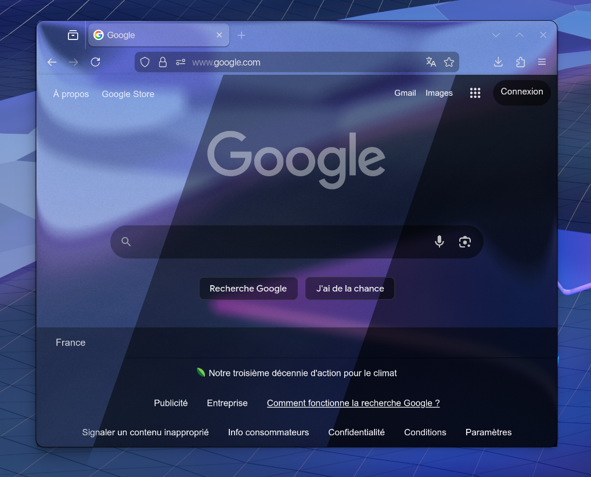
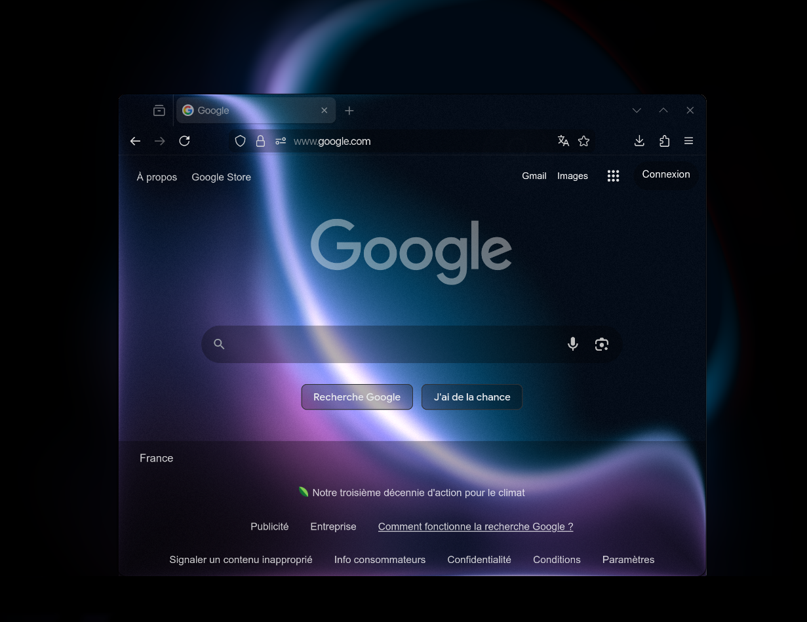
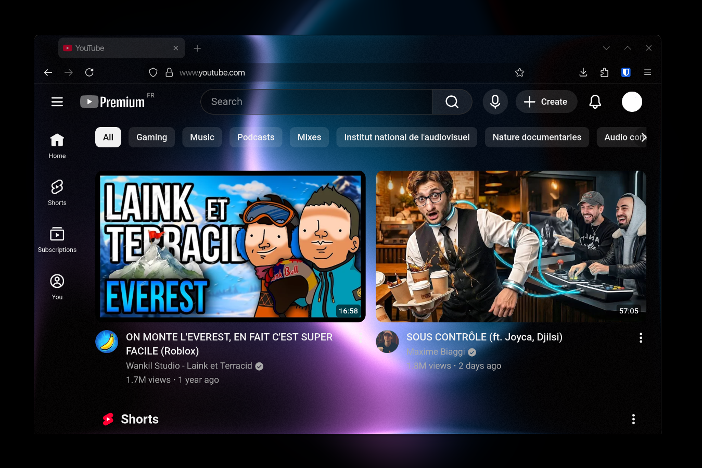
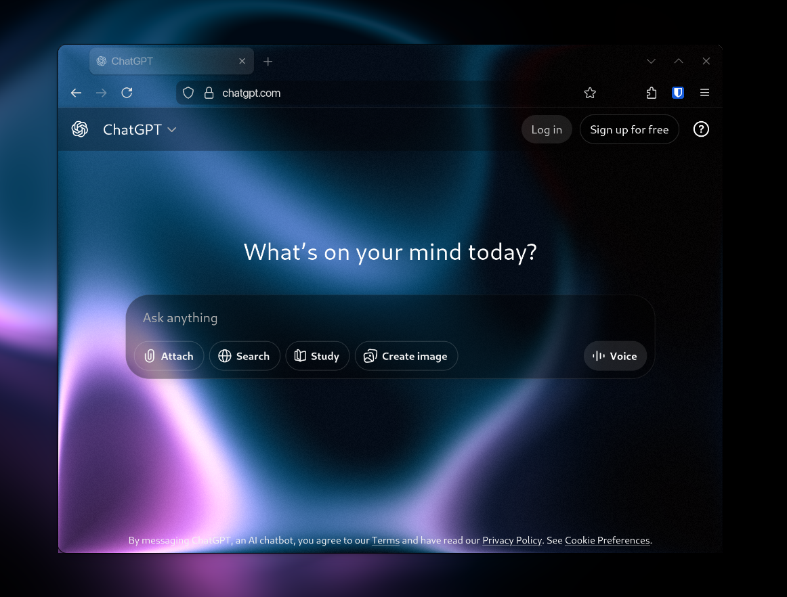

CSS user themes made with a transparent browser window in mind.

https://github.com/user-attachments/assets/5a663504-91df-49a4-8b05-5a87f26cc320

Every theme has a "Basic", "High Contrast" and "Higher Contrast" version available, as shown below:

# List of websites
## Google

    

## YouTube

    

## ChatGPT

    

